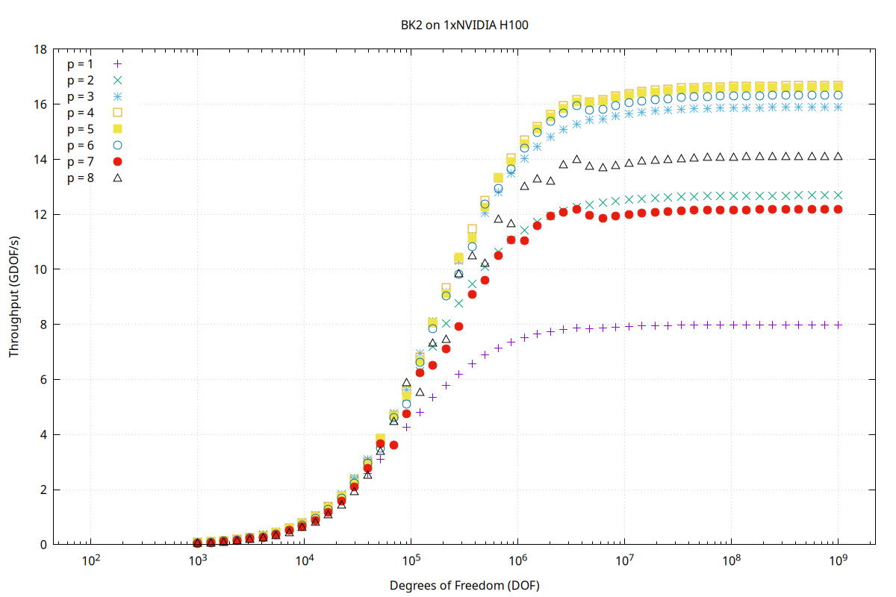

## BK1 Benchmarks and Input Parameters
### 1. **./kokkos_benchmark**

This benchmark compares the performance of the sum factorization algorithm implemented in **Kokkos**.

**Input parameters:**
- **nq0**, **nq1**, **nq2**: Quadrature points in each dimension (element dof per direction + 1)  
- **nelmt**: Number of elements  
- **numThreads**: Number of total threads 
- **threadsPerBlock**: Number of threads per block  
- **ntests**: Number of benchmark repetitions (minimum across all tests, used as a reference for comparison)

### 2. **./cuda_benchmark**

This benchmark compares different CUDA kernels implementing the sum factorization algorithm:

- **First kernel**: Uses a warp-centric approach, where each warp computes each element.
- **Second kernel**: Also uses a warp-centric approach but only works for linear elements (Q1, nm=2).  
- **Third kernel**: Uses a 1D grid and block configuration, where each block computes each element.
- **Fourth kernel**: Uses a 1D grid and 3D block layout, where each block computes each element.
- **Fifth kernel**: Also employs a 1D grid and 3D block layout, but with a simplified thread-to-data mapping — each thread processes one data element.

**Input parameters:**
- **nq0**, **nq1**, **nq2**: Quadrature points in each dimension (element dof per direction + 1)
- **nelmt**: Number of elements
- **numThreads**: Number of total threads
- **threadsPerBlockX, threadsPerBlockY, threadsPerBlockZ**: Number of threads per block in each dimension
- **ntests**: Number of benchmark repetitions (minimum across all tests, used as a reference for comparison)

### 3. **./templated_cuda_benchmark**

This benchmark also compares same CUDA kernels but most of the arguments are templated.

**Input parameters:**
- **nelmt**: Number of elements
- **numThreads**: Number of total threads
- **threadsPerBlockX, threadsPerBlockY, threadsPerBlockZ**: Number of threads per block in each dimension
- **ntests**: Number of benchmark repetitions (minimum across all tests, used as a reference for comparison)

### 4. **./output_benchmark**

This benchmark evaluates all parallel kernels across various polynomial orders, illustrating how the throughput (GDOF/s) of each kernel varies as the number of degrees of freedom (DOF) increases. All benchmark results are saved in the **`<outPath>`** directory. After setting the necessary input parameters in `plot.gp` file, plots can be generated by running:

```bash
cd <CMAKE_BUILD_DIR>/<outPath> 
gnuplot plot.gp
```
**Input parameters:**
- **polyOrderBegin**, **polyOrderEnd**: Polynomial order bounds 
- **dof_ExpBegin**, **dof_ExpEnd**: Range of DOF values as powers of 10 (i.e., DOF = 10^exp)
- **dof_NumSample**: Number of sample between degree of freedom bounds
- **nElmtPerBlock**: Number of elements assigned to each thread blocks 
- **ntests**: Number of benchmark repetitions (minimum across all tests, used as a reference for comparison)
- **outPath**: Output path for the results

The following plot illustrates the kokkos kernel results on Nvidia H100 GPU:


## GPU profiling (CUDA only)
To gain better insight and obtain detailed performance metrics, reports from **Nsight Systems** and **Nsight Compute** can be automatically generated — provided that the appropriate `nsys` and `ncu` environment variables are set. Run the following to generate reports:

```bash
make reportBK1
```
The reports will be saved in the **`<build_dir>/BK1/reports/`** directory.

To view the results using the Nvidia profiler tools:
```bash
cd build/BK1/reports
ncu-ui benchmark_3_3_3_400000_27000_1.ncu-rep
nsys-ui benchmark_3_3_3_400000_27000_1.nsys-rep